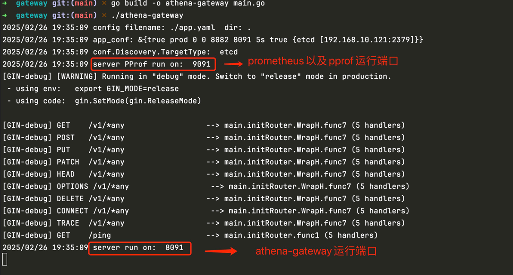
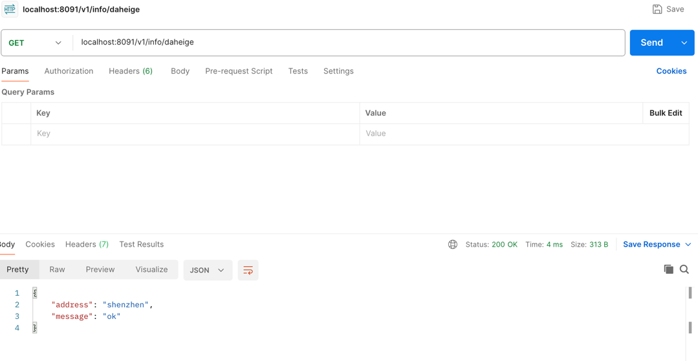
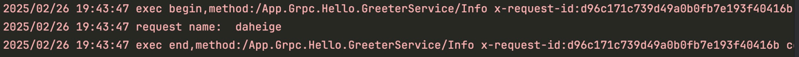

# grpc http gateway
    针对proto文件中指定的路由地址，通过grpc http proxy的方式转发到对应的grpc微服务方法上，运行原理如下图所示


# 编译运行
首先启动grpc微服务，参考rpc/readme.md文件，然后修改app.yaml中的配置，最后执行如下命令即可运行gateway
```shell
go build -o athena-gateway main.go
./athena-gateway
```
运行效果如下：


接下来，可以通过postman请求http接口，会自动转发到对应的grpc微服务

此时服务端日志输出如下：

