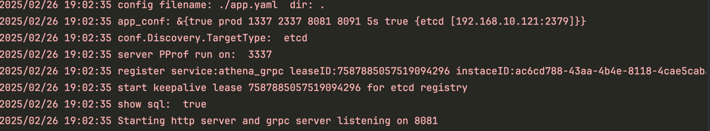
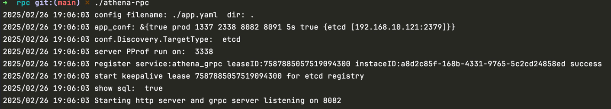
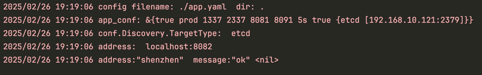
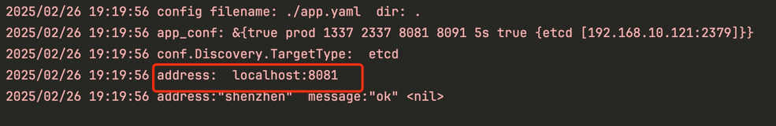

# rpc如何启动多个端口
只需要更改app.yaml中monitor_port、grpc_port端口即可部署多个rpc应用程序
```yaml
app_conf:
  app_debug: true # 是否开启调试模式
  app_env: prod # prod,test,local,dev
  http_port: 1337 # http
  monitor_port: 2338 # pprof性能监控和prometheus监控端口，这是通过http服务访问
  grpc_port: 8082
  grpc_gateway_port: 8091
  graceful_wait: 5s # 平滑退出等待时间，单位s
```

# 编译运行
```shell
go build -o athena-rpc
#启动方式
athena-rpc
```
使用8081端口，程序启动后的效果

使用8082端口，程序启动的效果


# 验证服务发现
进入 clients目录中将app.yaml文件的配置修改如下：
```yaml
app_conf:
  # 服务注册和发现配置
  enable_discovery: true # 开启etcd服务发现
  discovery:
    target_type: etcd
    endpoints:
      - "192.168.10.121:2379" # 地址可以根据实际情况自行更改
```
接着运行 go run client.go 效果如下

多次请求后，发现请求的address会发生改变，效果如下
